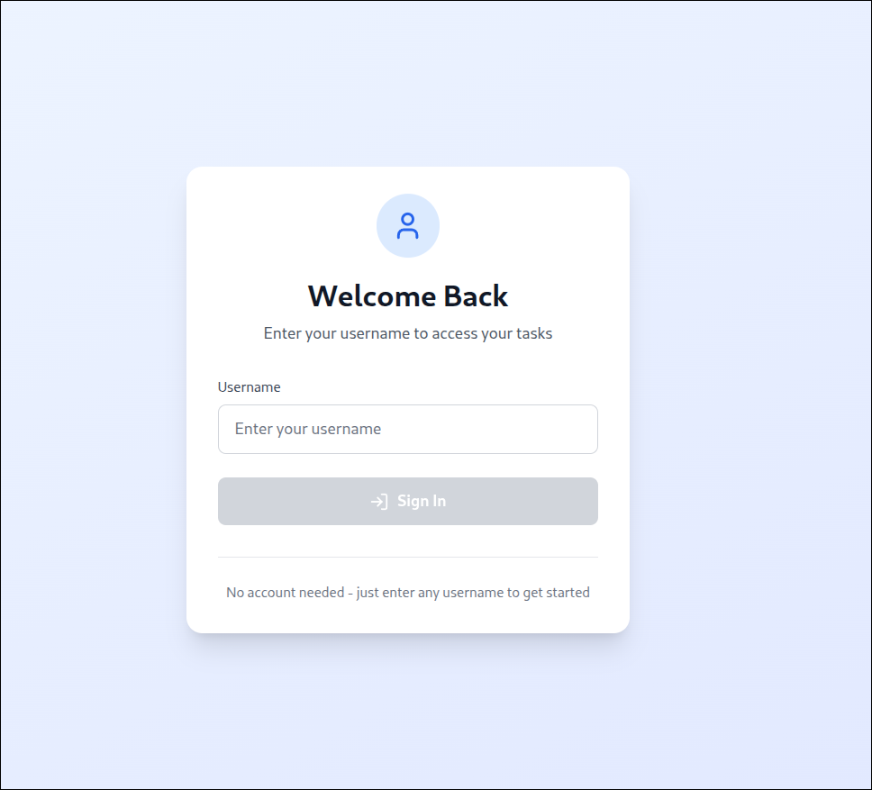
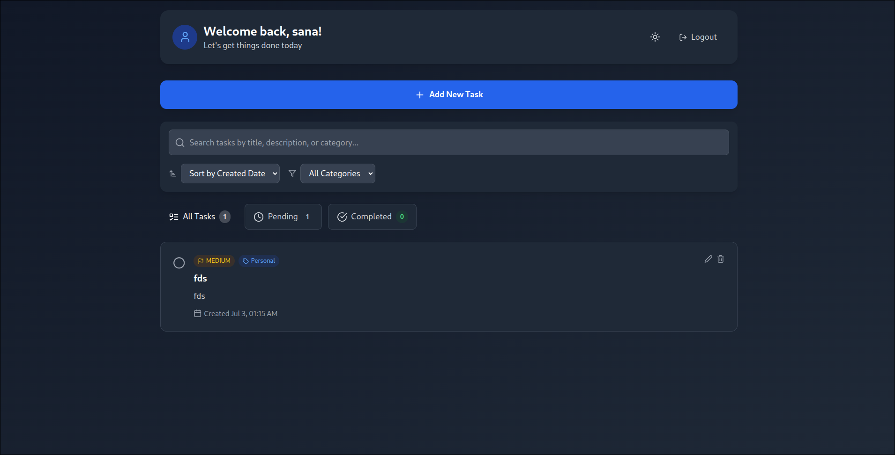

# Personal Task Tracker

## 📖 Description
A simple and responsive personal task management application built with React.js. The app allows users to log in (locally), add, edit, delete, and manage tasks with filtering for completed and pending tasks. Data persists in localStorage, so your tasks stay saved even after refreshing the page.

## 🚀 Features
- Simple login with username (stored in localStorage)
- Add tasks with title (required) and description (optional)
- Edit and delete tasks with confirmation on delete
- Toggle tasks as completed or pending
- Filter tasks by All, Completed, or Pending
- Show task counts for each filter
- Display creation date/time for each task
- Data persistence using localStorage
- Responsive design (mobile + desktop)

## 🌟 Bonus Features 
<!-- Remove if you didn’t implement these -->
- [-] Search functionality
- [-] Task priority levels
- [-] Due dates for tasks
- [-] Smooth animations/transitions
- [-] Dark mode toggle
- [-] Task categories/tags

## 🛠 Setup Instructions
1. Clone the repository:
    ```bash
    git clone https://github.com/sanatan-dive/RYGneco
    cd project
    ```
2. Install dependencies:
    ```bash
    npm install
    ```
3. Run the app locally:
    ```bash
    npm start
    ```
4. Open your browser at:
    ```
    http://localhost:3000
    ```

## 🧰 Technologies Used
- React.js (Functional Components + Hooks)
- Taiwind CSS
- LocalStorage for data persistence

## 🔗 Live Demo
[View Live App](https://ry-gneco.vercel.app/)

## 🖼 Screenshots
<!-- Replace the image URLs with your screenshots -->
| Login Page | Task Dashboard |
|------------|----------------|
|  |  |

## 📂 Project Structure
task-tracker/
├── public/
│ └── index.html
├── src/
│ ├── components/
│ │ ├── Login.js
│ │ ├── TaskForm.js
│ │ ├── TaskItem.js
│ │ ├── TaskList.js
│ │ └── TaskFilter.js
│ ├── utils/
│ │ └── localStorage.js
│ ├── styles/
│ │ └── App.css
│ ├── App.js
│ └── index.js
├── README.md
└── package.json


## 💡 Notes
- All features work as expected and have been tested for edge cases (e.g., empty task title validation, task persistence).
- Clean and organized code with proper React component structure.
- Fully responsive design tested on mobile and desktop.

## 📬 Submission
- **GitHub Repo:** [https://github.com/sanatan-dive/RYGneco](https://github.com/sanatan-dive/RYGneco)
- **Live Demo:** [https://ry-gneco.vercel.app/](https://ry-gneco.vercel.app/L)

---

## 🙌 Thank you for reviewing my submission!
